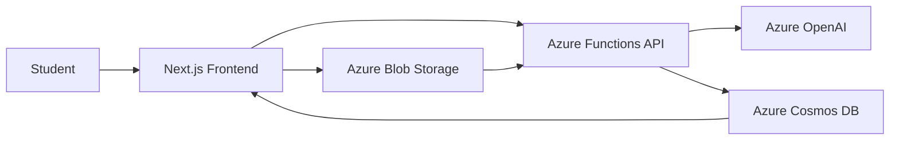

# Architecture Overview

## System Context

Azure StudyMate AI is a cloud-native platform that allows students to upload notes and receive AI-generated learning outputs.

## Design Principles

- Modular and service-oriented architecture
- Secure and validated file ingestion
- Scalable AI orchestration through Azure Functions
- Cloud-native observability and deployment readiness

## Runtime Responsibilities

- Frontend handles user experience and product pages.
- Azure Functions processes study requests and coordinates storage and AI services.
- Blob Storage stores uploaded assets.
- Cosmos DB stores study history and metadata.
- Azure OpenAI generates summaries, quizzes, and flashcards.
